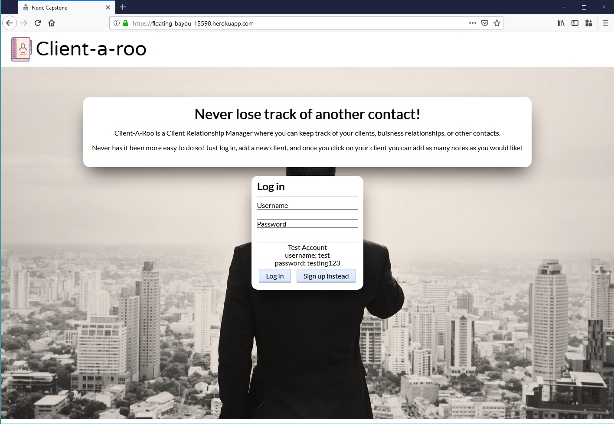
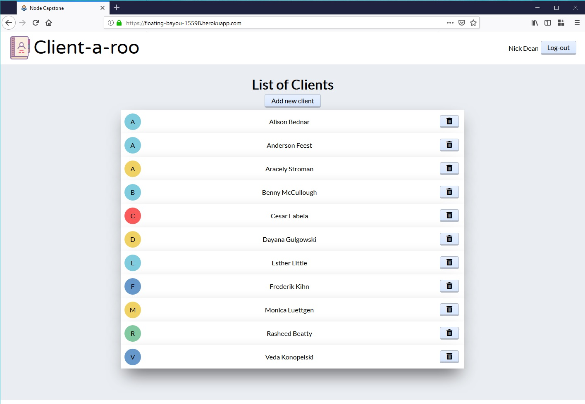
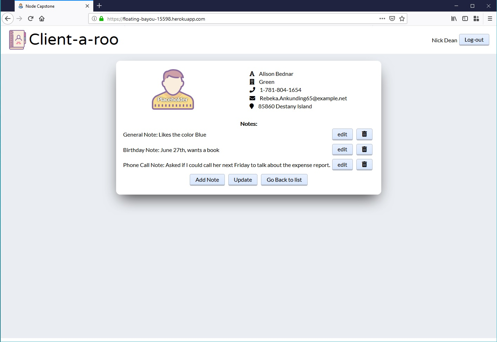
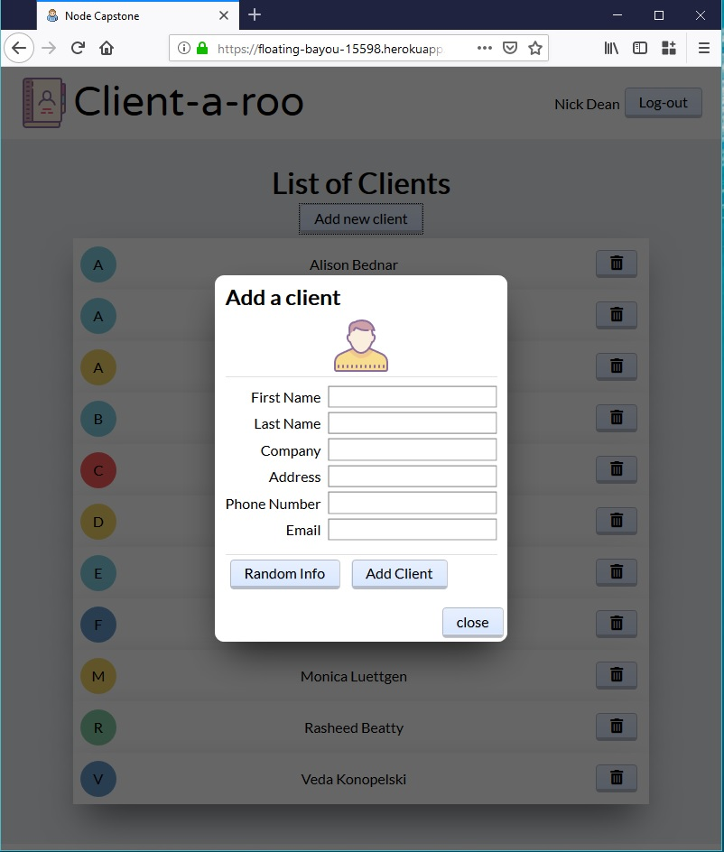
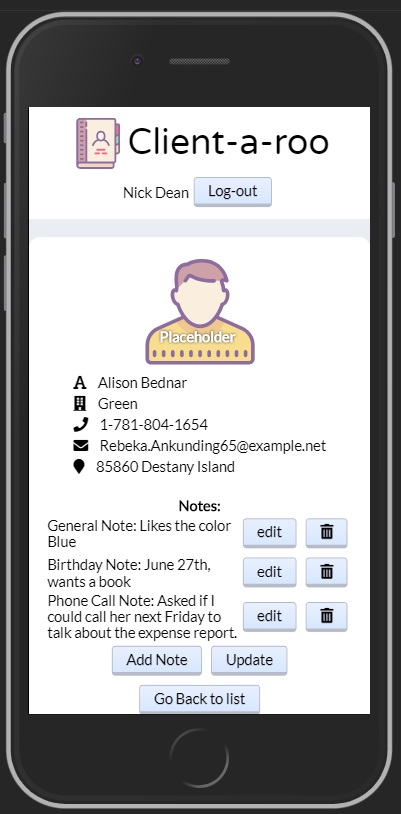

# Node Capstone Project - Contact-a-roo

## Apps Purpose

A Client Relationship Manager (CRM) where you can keep track of your clients, and add various notes to help you stay on top of your work.

## Live Demo

Heroku link - https://floating-bayou-15598.herokuapp.com/

## Screenshots

## User stories:

**As a user I should be able to track my many clients and keep different types of notes organized with that particular client**

## Built With

### Front End

- HTML
- CSS (Flexbox)
- Javascript (ES6)

### Back End

- Node.js
- Express
- bcryptjs
- Json Web Tokens (JWT)
- Passport.js (authentication)
- Mongo
- Mongoose
- Morgan (logging)

### Testing

- Chai
- Mocha
- Faker.js

### Development Tools

- ESLint (moddified AirBnB standard)
- Prettier

Important functinality for minimum viable product:

- [x] **View list of my clients**
- [x] **Create a new client**
- [x] **Delete a client**
- [x] **Update client details**
- [x] **Add notes to client**
- [x] **Sign up**
- [x] **Log in**
- [x] View details of a client

Future features to implement:

- [ ] **Create or setup a reminder to follow up with a client**
- [ ] Log calls/interactions with client
- [ ] Reset password
- [ ] See a record of when I contacted client
- [ ] Connect e-mail to log and create e-mails
- [ ] Connect phone to log and call client
- [ ] Add ability to add/change user image

## Schemas

Users - id
username,
email,
password,
list of client

client -
user client is assigned to
client color (used for displaying on client list)
name,
phone number,
address,
company,
email

Notes -
note body,
description,
id of user/client/company

(Future release) Reminders -
name,
id of user/client,
created time,
time to be sent

## Screens the user will interact with:

MVP Important:

- [x] Landing page to describe what the app is (requirement for project)
- [x] List or Directory of clients
- [x] Add client contact, look up pre-existing client or add new client
- [x] Notes: enter notes
- [x] Sign-up or log-in screen

Future Feature screens:

- [ ] way to reset password
- [ ] After login, see any alerts for contact reminders
- [x]  Click on their name to go to their record
  Possibly click on call/text/email to do the action and automatically create log of communication
- [ ] Once the correct client is found or created, add point of contact 
- [ ] Choose type: Phone Call/Text/Email/In Person
- [ ] Followup Needed? Yes/No
- [ ] Date/Time for reminder to follow up
- [ ] Recurring reminder?
- [ ] Click to view recent contacts with this client

## User flow

| Landing Page    | List of Clients            | Client Details         |
| --------------- | -------------------------- | ---------------------- |
| app info        | view brief details         | view all details       |
| sign up/ log in | click to open more details | create or set reminder |
|                 | delete client              | add notes to client    |
|                 | create a new client        |                        |

## Projected Timeline

- [x] Design MVP - 2 hours
- [x] Setup CI, tests, and first deployment - 2 hours
- [x] Setup routes
- [x] ...and add tests - 2 hours
- [x] Define Your API by Building Your Client - 5 hours
- [x] Provision your database - 1 hour
- [x] Complete GET endpoint and test - 6 hours
- [x] Complete POST endpoint and test - 6 hours
- [x] Complete PUT endpoint and test - 6 hours
- [x] Complete DELETE endpoint and test - 6 hours
- [x] Code the front end of the app - 8 hours
- [x] Gather user feedback and Write up your findings - 3 hours
- [x] Complete any revisions needed - 5 hours
- [x] Polish - 6 hours
- [x] Comment and clean up code - 3 hours
- [x] Cross-browser test your client and fix any bugs - 6 hours

68 hours total
